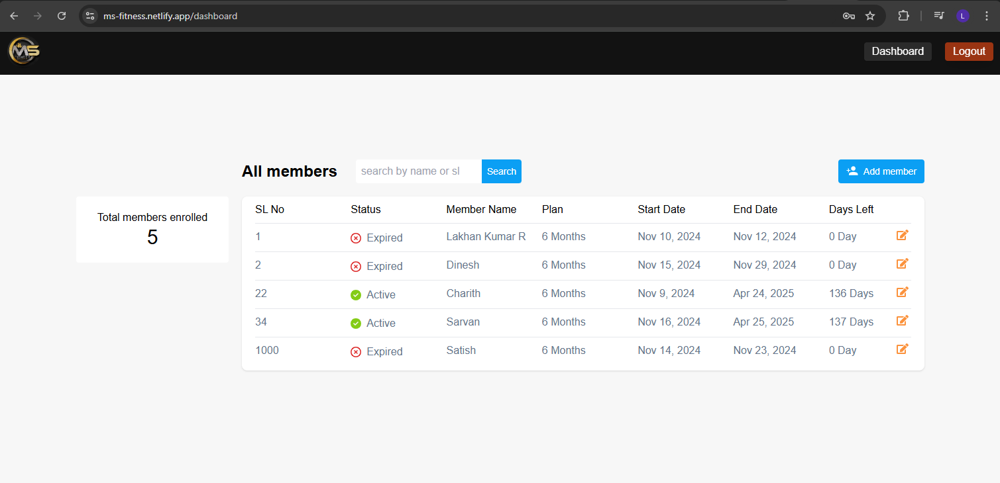

# Gym Website - MS Fitness, Bengaluru

A modern and user-friendly website for a gym that showcases its services, testimonials, and contact information. This project also includes an admin dashboard for efficient management of the website's content and functionality.

## Live Demo

Check out the live demo here: https://ms-fitness.netlify.app/

## Screenshots

### Admin Dashboard

## Features

### User Interface

- Hero Section: Includes a 'Join' button that smoothly navigates to the contact section.
- Testimonials Section: Displays feedback from satisfied clients.
- Services Section: Highlights the gym's offerings in a visually appealing way.
- Contact Section: Provides a Google Maps integration for location details.
- Responsive Design: Optimized for viewing on devices of all sizes.

### Admin Dashboard

- User Management: Allows the admin to add or update the users details and their memberships.
- Search Users: Allows the admin to search the users using their SL numbers or names.
- User-Friendly Interface: Simplified design for non-technical users.

## Tech Stack

- React.js: Front-end framework for building the user interface.
- HTML5: Markup language for structuring the website.
- CSS3: Styling to enhance visual appeal.
- Tailwind CSS: Utility-first framework for responsive design.
- JavaScript: Interactive and dynamic behavior.

## Project Goals

- Simplify members management.
- Simplify the gym's online presence.
- Attract potential members with a professional design.
- Provide an easy-to-use platform for the admin to manage the website's content.

## How to Use

### User Interface

1. Clone the repository:
   `git clone https://github.com/lakhan0105/gym-website.git`

2. Install dependencies:
   `npm install`

3. Run the project locally:
   `npm run dev`

## Admin Dashboard

1. Access the admin dashboard via the /admin route (or specified route in your implementation).
2. Use admin credentials to log in (if authentication is implemented).

## Future Enhancements

Integration of online booking and payment systems.
Incorporating a blog for fitness tips and advice.
Enhanced admin functionalities, such as user management and detailed analytics.

## Environment variables in this app

- VITE_APPWRITE_ENDPOINT
- VITE_APPWRITE_PROJECT_ID

- VITE_MS_FITNESS_DATABASE_ID
- VITE_MEMBERS_DATA_COLLECTION_ID

- VITE_COUNTS_DATA_COLLECTION_ID
- VITE_TOTALMEMBERS_DOC_ID
